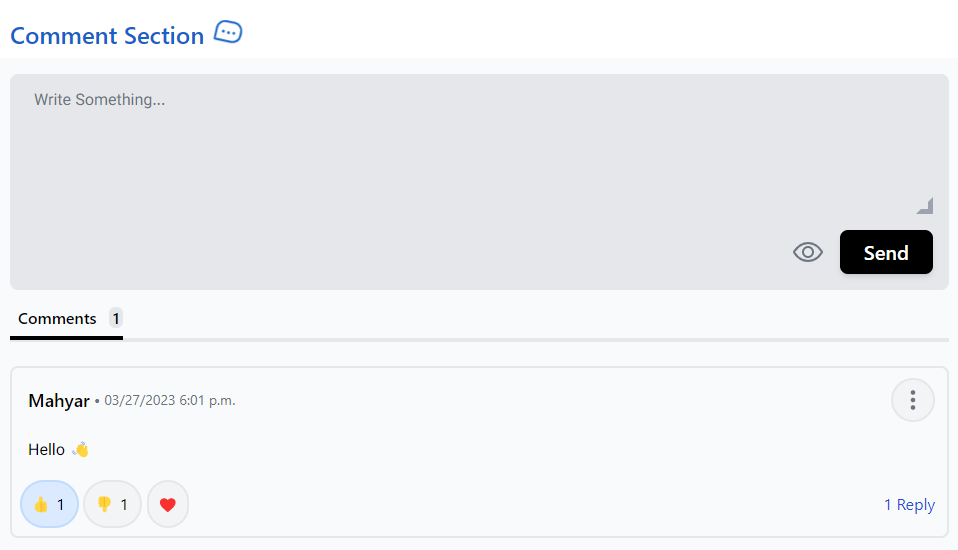

# Django Comment System

<p align="center">
  
</p>

[](https://pypi.org/project/django-comment-system)
[](https://pypistats.org/packages/django-comment-system)
[](LICENSE)

**Here is a [live demo](https://mmaahhyyaarr.pythonanywhere.com/)**

## Table of Contents

* [Installation](#installation)
* [Configuration](#configuration)
* [Usage](#usage)
* [Settings](#settings)
    * [Global Settings](#global-settings)
    * [Config Settings](#config-settings)
* [Reactions](#reactions)
* [Translation](#translation)
* [Front-End](#front-end)
* [Live Demo](https://mmaahhyyaarr.pythonanywhere.com/)

## Installation

1. Install using pip

   ```shell
   python -m pip install django-comment-system
   ```

   or Clone the repository then copy `comment` folder and paste in project folder.

   ```shell
   git clone https://github.com/mahyar-amiri/django-comment-system.git
   ```

## Configuration

1. Add `comment.apps.CommentConfig` to installed_apps in the `settings.py` file after `django.contrib.auth`.

   ```python
   # setting.py
   from django.urls import reverse_lazy

   INSTALLED_APPS = [
       'django.contrib.admin',
       'django.contrib.auth',
       'django.contrib.contenttypes',
       'django.contrib.sessions',
       'django.contrib.messages',
       'django.contrib.staticfiles',
   
       # MY APPS
       'comment.apps.CommentConfig',
   ]
   
   LOGIN_URL = reverse_lazy('admin:login')  # or your account login url
   
   MEDIA_URL = '/media/'
   MEDIA_ROOT = BASE_DIR / 'media'
   ```

2. Add `path('comment/', include('comment.urls')),` to urlpatterns in the `urls.py` file.

   ```python
   # urls.py

   from django.urls import path, include

   urlpatterns = [
        path('comment/', include('comment.urls')),
   ]
   
   urlpatterns += static(settings.MEDIA_URL, document_root=settings.MEDIA_ROOT)
   ```

3. Connect `comments` to target model. In `models.py` add the field `comments` as a GenericRelation field to the
   required model.

   **NOTE:** Please note that the field name must be `comments` **NOT** `comment`.

   ```python
   # models.py
   
   from django.db import models
   from django.contrib.contenttypes.fields import GenericRelation
   from comment.models import Comment
   
   class Article(models.Model):
       title = models.CharField(max_length=20)
       content = models.TextField()
       # the field name should be comments
       comments = GenericRelation(Comment)

   ```

4. Do migrations
   ```shell
   python manage.py migrate
   ```

## Usage

1. In the template (e.g. post_detail.html) add the following template tags where obj is the instance of post model.
   ```html
   
   ```

2. Add the following template tags where you want to render comments.
   ```html
     {# Render all the comments belong to the passed object "obj" #}
   ```
   if your context_object_name is not `obj` (e.g. article) replace obj with context_object_name.
   ```html
   
   ```

## Settings

### Global Settings

You can customize global settings by adding keywords to `COMMENT_SETTINGS` dictionary in project `settings.py`.

```python
# setting.py
COMMENT_SETTINGS = {
    # generated urlhash length
    'URLHASH_LENGTH': 8,

    # if True, tailwindcss and jquery package will be loaded from static files.
    'OFFLINE_IMPORTS': True,

    # if None, comments will be shown without profile image
    # you should set this value as profile image field name
    # for example our abstract user profile picture field is profile_image
    #  so we set PROFILE_IMAGE_FIELD = 'profile.image'
    # see link blew to create abstract user model
    # https://docs.djangoproject.com/en/4.1/topics/auth/customizing/#substituting-a-custom-user-model
    'PROFILE_IMAGE_FIELD': None,
    # default profile image static path
    'PROFILE_IMAGE_DEFAULT': 'img/profile.png'
}
```

### Config Settings

This settings can be configured in admin panel. Set your config in `CommentSettings` model.

```python
# the comments need to be set as a(Accepted) to be shown in the comments list.
# if True, comment status will be set as d(Delivered) otherwise it will be set as a(Accepted).
STATUS_CHECK = False

# activate spoiler comment mode
ALLOW_SPOILER = True
# let users reply to a comment
ALLOW_REPLY = True
# let users edit their comment
ALLOW_EDIT = True
# let users delete their comment
ALLOW_DELETE = True

# more than this value will have Read More button in comment content
CONTENT_WORDS_COUNT = 40

# let users react to a comment
ALLOW_REACTION = True
# get emoji or from file source
REACTION_TYPE = 'emoji'  # emoji / source

# number of comments per page
# set 0 if you don't want pagination
PER_PAGE = 10

TIME_TYPE = 1  # 1.both 2.from_now 3.date_time
TIME_DAYS = 3  # less will use type 2 , more will use type 3

# set direction of comment section
THEME_DIRECTION = 'ltr'  # ltr / rtl
# set True for dark mode
THEME_DARK_MODE = False
```

## Reactions

1. Use admin panel to add react emoji. you will need an emoji and an emoji name as slug. You can use image or gif instead of emoji character: In your admin panel, add image or gif file in React object.

2. Add `MEDIA_URL` and `MEDIA_ROOT` in `settings.py`.

   ```python
   # settings.py

   MEDIA_URL = '/media/'
   MEDIA_ROOT = BASE_DIR / 'media'
   ```

3. Add root to `urlpatterns` in project `urls.py`.

   ```python
   # urls.py
   
   from django.conf import settings
   from django.conf.urls.static import static
   
   urlpatterns = [...]
   
   urlpatterns += static(settings.MEDIA_URL, document_root=settings.MEDIA_ROOT)
   ```

4. Rerun project and setup Reaction type to `source` in admin panel Comment Settings.

## Translation

1. Add `locale` folder to your app folder.
2. Run command below to create `django.po` file for your language.

   Find your language code [here](https://en.wikipedia.org/wiki/List_of_ISO_639-1_codes).
   ```shell
   python manage.py makemessages -l MY_LANGUAGE_CODE
   # for generating translations corresponding to javascript code
   python manage.py makemessages -l MY_LANGUAGE_CODE -d djangojs
   ```

   e.g. The persian language code is `fa`.

   ```shell
   python manage.py makemessages -l fa
   python manage.py makemessages -l fa -d djangojs
   ```
   This will create two `.po` files inside the `locale/{MY_LANGUAGE_CODE}/LC_MESSAGES/` directory.

3. After adding translation to both files, run the following command to verify everything is working.
   ```shell
   python manage.py compilemessages -l MY_LANGUAGE_CODE
   # e.g. for persian translation use fa instead of MY_LANGUAGE_CODE
   ```
   If you don't see an error in the last command, your translations have been added in the correct format.

4. In `settings.py` to enable internationalization in your django applications.
   ```python
   # settings.py

   USE_I18N = True
   USE_L18N = True
   LANGUAGE_CODE = '{MY_LANGUAGE_CODE}'  # 'en-us' for english , 'fa-ir' for persian , ...
   ```

## Front-End

<details>
<summary>Tailwind Colors Customization</summary>
<p>

```text
colors: {
   // LIGHT
   'text-light': '#ffffff',
   'background-light': '#f8fafc',
   // TEXTAREA
   'textarea-bg-light': '#e5e7eb',
   'textarea-scroll-light': '#9ca3af',
   'textarea-text-light': '#000000',
   'textarea-text-selection-light': '#c7d2fe',
   'textarea-text-placeholder-light': '#6b7280',
   'textarea-border-empty-light': '#f87171',
   // ICON
   'icon-spoiler-light': '#6b7280',
   'icon-spoiler-option-light': '#111827',
   'icon-dots-light': '#6b7280',
   'icon-pin-light': '#6b7280',
   'icon-edit-light': '#16a34a',
   'icon-delete-light': '#ef4444',
   'icon-pagination-light': '#9ca3af',
   'icon-pagination-hover-light': '#374151',
   // BUTTON
   'btn-send-bg-light': '#000000',
   'btn-send-text-light': '#ffffff',
   'btn-edit-bg-light': '#16a34a',
   'btn-edit-text-light': '#ffffff',
   'btn-reply-bg-light': '#2563eb',
   'btn-reply-text-light': '#ffffff',
   'btn-delete-bg-light': '#dc2626',
   'btn-delete-text-light': '#ffffff',
   'btn-cancel-bg-light': '#6b7280',
   'btn-cancel-text-light': '#ffffff',
   'btn-login-text-light': '#1d4ed8',
   // DELETE FORM
   'delete-from-bg-light': '#ffffff',
   'delete-from-text-light': '#111827',
   'delete-from-subtext-light': '#6b7280',
   // COUNTER
   'section-primary-light': '#e5e7eb',
   'section-secondary-light': '#000000',
   'section-text-light': '#000000',
   'section-number-bg-light': '#e5e7eb',
   'section-number-text-light': '#000000',
   // PAGINATION
   'page-current-bg-light': '#000000',
   'page-current-text-light': '#ffffff',
   'page-bg-light': 'transparent',
   'page-bg-hover-light': '#9ca3af',
   'page-text-light': '#9ca3af',
   'page-text-hover-light': '#ffffff',
   // COMMENT
   'comment-parent-bg-light': '#f8fafc',
   'comment-parent-border-light': '#e5e7eb',
   'comment-child-bg-light': '#f8fafc',
   'comment-child-border-light': '#a5b4fc',
   // REPLY
   'reply-text-light': '#1d4ed8',
   'reply-border-light': '#4b5563',
   // REACTION
   'react-default-bg-light': '#f3f4f6',
   'react-default-border-light': '#e5e7eb',
   'react-selected-bg-light': '#dbeafe',
   'react-selected-border-light': '#bfdbfe',
   'react-count-text-light': '#000000',
   // COMMENT BODY
   'comment-name-text-light': '#000000',
   'comment-time-text-light': '#6b7280',
   'comment-option-bg-light': '#f3f4f6',
   'comment-option-borer-light': '#6b7280',
   'comment-read-more-light': '#1d4ed8',
   // DARK
   'text-dark': '#000000',
   'background-dark': '#1e293b',
   // TEXTAREA
   'textarea-bg-dark': '#475569',
   'textarea-scroll-dark': '#9ca3af',
   'textarea-text-dark': '#f3f4f6',
   'textarea-text-selection-dark': '#4338ca',
   'textarea-text-placeholder-dark': '#94a3b8',
   'textarea-border-empty-dark': '#f87171',
   // ICON
   'icon-spoiler-dark': '#e5e7eb',
   'icon-spoiler-option-dark': '#e5e7eb',
   'icon-dots-dark': '#e5e7eb',
   'icon-pin-dark': '#d1d5db',
   'icon-edit-dark': '#4ade80',
   'icon-delete-dark': '#f87171',
   'icon-pagination-dark': '#9ca3af',
   'icon-pagination-hover-dark': '#6b7280',
   // BUTTON
   'btn-send-bg-dark': '#e2e8f0',
   'btn-send-text-dark': '#000000',
   'btn-edit-bg-dark': '#16a34a',
   'btn-edit-text-dark': '#ffffff',
   'btn-reply-bg-dark': '#2563eb',
   'btn-reply-text-dark': '#ffffff',
   'btn-delete-bg-dark': '#ef4444',
   'btn-delete-text-dark': '#ffffff',
   'btn-cancel-bg-dark': '#e2e8f0',
   'btn-cancel-text-dark': '#000000',
   'btn-login-text-dark': '#60a5fa',
   // COUNTER
   'section-primary-dark': '#374151',
   'section-secondary-dark': '#e5e7eb',
   'section-text-dark': '#ffffff',
   'section-number-bg-dark': '#4b5563',
   'section-number-text-dark': '#000000',
   // DELETE FORM
   'delete-from-bg-dark': '#475569',
   'delete-from-text-dark': '#f3f4f6',
   'delete-from-subtext-dark': '#d1d5db',
   // PAGINATION
   'page-current-bg-dark': '#475569',
   'page-current-text-dark': '#ffffff',
   'page-bg-dark': 'transparent',
   'page-bg-hover-dark': '#334155',
   'page-text-dark': '#9ca3af',
   'page-text-hover-dark': '#ffffff',
   // COMMENT
   'comment-parent-bg-dark': '#1e293b',
   'comment-parent-border-dark': '#4b5563',
   'comment-child-bg-dark': '#1e293b',
   'comment-child-border-dark': '#a5b4fc',
   // REPLY
   'reply-text-dark': '#93c5fd',
   'reply-border-dark': '#4b5563',
   // REACTION
   'react-default-bg-dark': '#334155',
   'react-default-border-dark': '#6b7280',
   'react-selected-bg-dark': '#64748b',
   'react-selected-border-dark': '#1e293b',
   'react-count-text-dark': '#f3f4f6',
   // COMMENT BODY
   'comment-name-text-dark': '#f3f4f6',
   'comment-time-text-dark': '#d1d5db',
   'comment-option-bg-dark': '#475569',
   'comment-option-borer-dark': '#6b7280',
   'comment-read-more-dark': '#93c5fd',
}
```

</p>
</details>

<details>
<summary>Templates Folder Tree</summary>
<p>

```text
templates/comment
   ├── comment
   │    ├── comments.html
   │    ├── comment_list.html
   │    ├── comment_counter.html
   │    ├── comment_body.html
   │    ├── comment_reactions.html
   │    └── object_info.html
   │
   ├── forms
   │    ├── comment_form_create.html
   │    ├── comment_form_reply.html
   │    ├── comment_form_edit.html
   │    └── comment_form_delete.html
   │
   ├── icons
   │    ├── icon_arrow_backward.html
   │    ├── icon_arrow_forward.html
   │    ├── icon_delete.html
   │    ├── icon_dots.html
   │    ├── icon_down.html
   │    ├── icon_edit.html
   │    ├── icon_eye.html
   │    ├── icon_eye_off.html
   │    └── icon_up.html
   │
   └── utils
        ├── comment_list_pagination.html
        ├── comment_list_loader.html
        ├── comment_list_empty.html
        ├── IMPORTS.html
        └── SCRIPTS.html
```

</p>
</details>


<details>
<summary>Static Folder Tree</summary>
<p>

```text
static
   ├── css
   │    ├── style.css
   │    └── style.min.css
   ├── font
   │    ├── Vazir
   │    └── Vazir-FD
   ├── img
   │    └── profile.png
   ├── js
   │    ├── comment.js
   │    ├── comment.min.js
   │    └── jquery.min.js
   └── tailwindcss
        ├── style.css
        └── tailwind.config.js
```

</p>
</details>


<details>
<summary>IDs</summary>
<p>

```text
#comments
   ├── #comment-modal
   ├── #comment-list
   ├── #comment-react-list
   │
   ├── #comment-{urlhash}
   │
   ├── forms
   │    ├── #form-comment-create
   │    ├── #form-comment-edit-{urlhash}
   │    ├── #form-comment-delete-{urlhash}
   │    ├── #form-comment-reply-{urlhash}
   │    └── #form-comment-react-{urlhash}
   │
   └── toggles
        ├── #toggle-spoiler-{urlhash}
        ├── #toggle-edit-{urlhash}
        ├── #toggle-reply-{urlhash}
        └── #toggle-more-{urlhash}
```

</p>
</details>


<details><summary>Handle 403 ERROR Template Page</summary>
<p>

1. Create `403.html` in your template path.
2. Add custom view in `views.py`.
   ```python
   # views.py
   from django.shortcuts import render
   def custom_error_403(request, exception):
       return render(request, '403.html', {'exception': exception})
   ```
3. Add handler403 in your project `urls.py`
   ```python
   # urls.py
   handler403 = 'my_project.views.custom_error_403'
   ```

</p>
</details>


<details>
<summary>Minify Static Files</summary>
<p>

1. Installation
   ```shell
   npm i minify -g
   ```
2. Usage
   ```shell
   npm static/css/style.css > static/css/style.min.css
   npm static/js/comment.js > static/js/comment.min.js
   ```

</p>
</details>